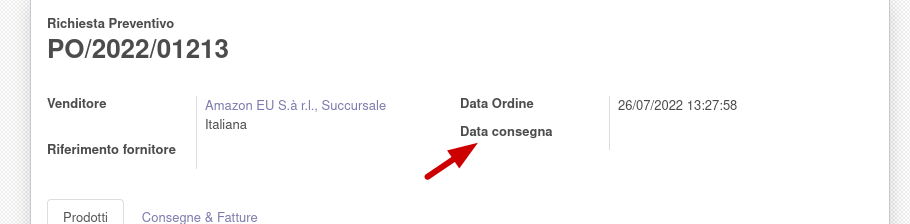
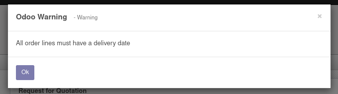
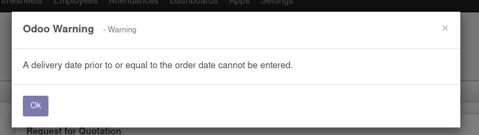

# This module adds delivery date field in purchase order.

### Add field in purchase order

### Raises an error if no delivery date is given during confirmation

### If order is confirmed the delivery date field is not editable

