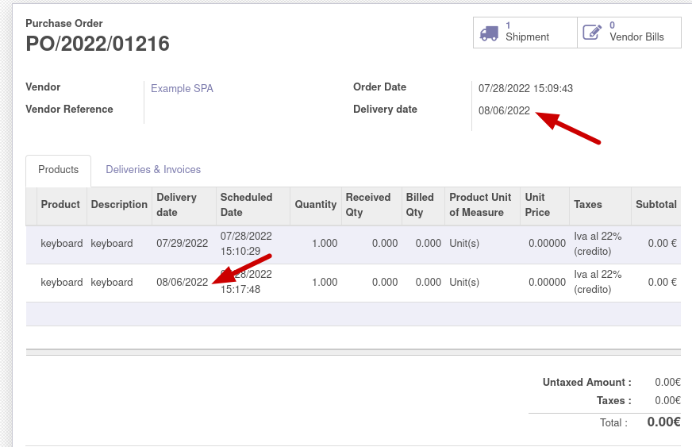

# This module adds delivery date field in purchase order.

### Add **delivery date** field in purchase order and order line

only the order line field can be edited, if you try to confirm the order without entering the dates a warning message will appear:

If you attempt to save a date earlier than the order date

after order confirm the farthest delivery date will be indicated in the **Delivery date** field within the order

